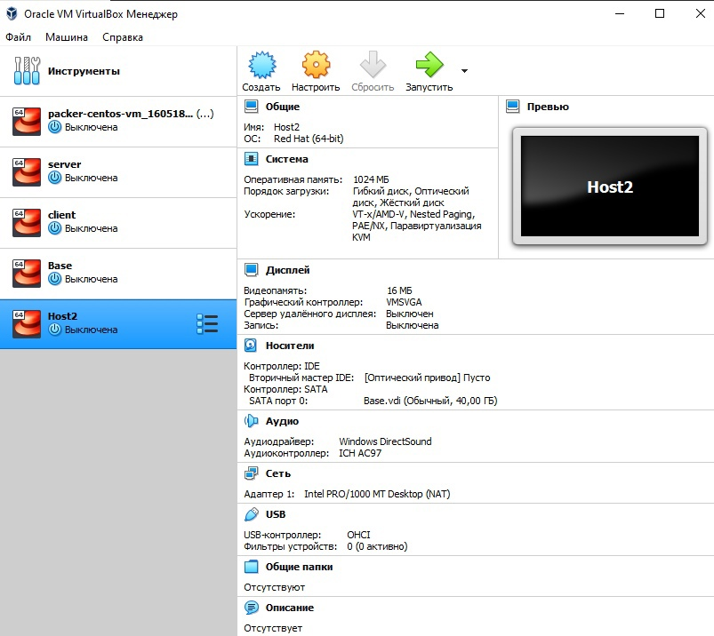

---
## Front matter
lang: ru-RU
title: Отчет по Лабораторной работе №1
author: |
	Шапошникова Айталина Степановна НПИбд-02-18\inst{1}
institute: |
	\inst{1}RUDN University, Moscow, Russian Federation

## Formatting
toc: false
slide_level: 2
theme: metropolis
header-includes: 
 - \metroset{progressbar=frametitle,sectionpage=progressbar,numbering=fraction}
 - '\makeatletter'
 - '\beamer@ignorenonframefalse'
 - '\makeatother'
aspectratio: 43
section-titles: true
---

## Цель работы
Приобретение практических навыков установки операционной системы на виртуальную машину, 
настройки минимально необходимых для дальнейшей работы сервисов. 

## Задание
Лабораторная работа подразумевает установку на виртуальную машину VirtualBox операционной системы Linux, дистрибутив Centos.

# Выполнение лабораторной работы
## **Подготовка к установке виртульной машины**

{ #fig:001 width=75% }

## **Настройка и создание виртульной машины Base**

{ #fig:002 width=75% }

## **Настройка и создание виртульной машины Base**

{ #fig:003 width=75% }

## **Настройка и создание виртульной машины Base**

{ #fig:004 width=75% }

## **Настройка и создание виртульной машины Base**

{ #fig:005 width=75% }

## **Настройка и установка CentOS**

{ #fig:006 width=75% }

## **Подключиться к виртуальной машине**

{ #fig:007 width=75% }

## **Подключиться к виртуальной машине**

{ #fig:008 width=75% }

## **Подключиться к виртуальной машине**

{ #fig:009 width=75% }

## **Создание виртульной машины Host2**

{ #fig:010 width=75% }

## **Создание виртульной машины Host2**

{ #fig:011 width=75% }

## Вывод

После выполнения лабораторной работы №1 я приобрела практические навыки установки операционной системы на виртуальную машину, настройки минимально необходимых для
дальнейшей работы сервисов.

## {.standout}

Спасибо за внимание!
