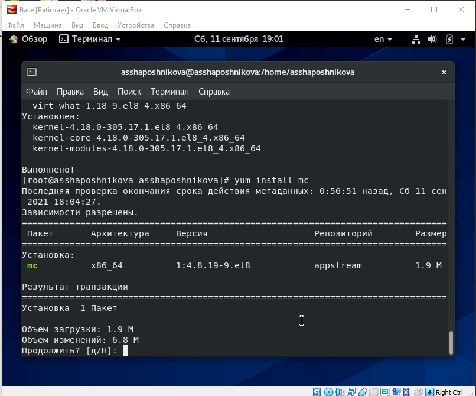
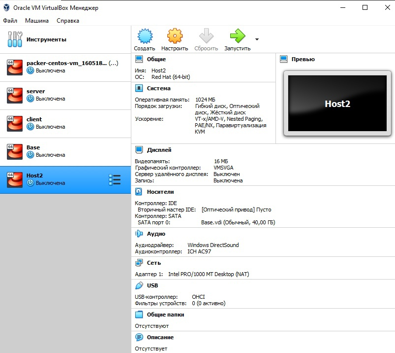

---
# Front matter
lang: ru-RU
title: "Отчёт по лабораторной работе №1"
subtitle: "Дисциплина: Информационная безопасность"
author: "Шапошникова Айталина Степановна, НПИбд-02-18"

# Formatting
toc-title: "Содержание"
toc: true # Table of contents
toc_depth: 2
lof: true # List of figures
lot: true # List of tables
fontsize: 12pt
linestretch: 1.5
papersize: a4paper
documentclass: scrreprt
polyglossia-lang: russian
polyglossia-otherlangs: english
mainfont: PT Serif
romanfont: PT Serif
sansfont: PT Sans
monofont: PT Mono
mainfontoptions: Ligatures=TeX
romanfontoptions: Ligatures=TeX
sansfontoptions: Ligatures=TeX,Scale=MatchLowercase
monofontoptions: Scale=MatchLowercase
indent: true
pdf-engine: lualatex
header-includes:
  - \linepenalty=10 # the penalty added to the badness of each line within a paragraph (no associated penalty node) Increasing the value makes tex try to have fewer lines in the paragraph.
  - \interlinepenalty=0 # value of the penalty (node) added after each line of a paragraph.
  - \hyphenpenalty=50 # the penalty for line breaking at an automatically inserted hyphen
  - \exhyphenpenalty=50 # the penalty for line breaking at an explicit hyphen
  - \binoppenalty=700 # the penalty for breaking a line at a binary operator
  - \relpenalty=500 # the penalty for breaking a line at a relation
  - \clubpenalty=150 # extra penalty for breaking after first line of a paragraph
  - \widowpenalty=150 # extra penalty for breaking before last line of a paragraph
  - \displaywidowpenalty=50 # extra penalty for breaking before last line before a display math
  - \brokenpenalty=100 # extra penalty for page breaking after a hyphenated line
  - \predisplaypenalty=10000 # penalty for breaking before a display
  - \postdisplaypenalty=0 # penalty for breaking after a display
  - \floatingpenalty = 20000 # penalty for splitting an insertion (can only be split footnote in standard LaTeX)
  - \raggedbottom # or \flushbottom
  - \usepackage{float} # keep figures where there are in the text
  - \floatplacement{figure}{H} # keep figures where there are in the text
---

# Цель работы

Приобретение практических навыков установки операционной системы на виртуальную машину, 
настройки минимально необходимых для дальнейшей работы сервисов.

# Задание

Лабораторная работа подразумевает установку на виртуальную машину VirtualBox операционной системы Linux, дистрибутив Centos.

# Выполнение лабораторной работы

Скачала и установила VirtualBox.

Скачала CentOS 8.

Создала каталог с именем пользователя asshaposhnikova и переместила туда образ виртуальной машины.

Запустила виртуальную машину.

Проверила в свойствах VirtualBox месторасположение каталога для
виртуальных машин (рис. -@fig:001).

{ #fig:001 width=75% }

Создала новую виртуальную машину.Указала имя виртуальной машины — Base, тип операционной системы
— Linux, RedHat (рис. -@fig:002). 

{ #fig:002 width=75% }

Указать размер основной памяти виртуальной машины — 1024 МБ (рис. -@fig:003).

{ #fig:003 width=75% }

Задала конфигурацию жёсткого диска (BirtualBox
Disk Image) (рис. -@fig:004).

{ #fig:004 width=75% }

Задала размер диска — 40 ГБ (рис. -@fig:005).

{ #fig:005 width=75% }

Выделила в окне менеджера VirtualBox виртуальную машину Base, и открыла окно Свойства. Проверила, что папка для снимков виртуальной машины Base имеет правильный путь (рис. -@fig:006).

{ #fig:006 width=75% }

Выбрала в VirtualBox Свойства Носители виртуальной машины Base.
Добавила новый привод оптических дисков и выбрать образ CentOS 8 (рис. -@fig:007).

{ #fig:007 width=75% }

Запустила виртуальную машину Base, выбрала установку системы на жёсткий диск.
Установила русский язык для интерфейса и раскладки клавиатуры.
В качестве имени машины указать «asshaposhnikova.localdomain» (рис. -@fig:008).

{ #fig:008 width=75% }

Указать часовой пояс «Москва» (рис. -@fig:009).

{ #fig:009 width=75% }

Установила пароль для root (рис. -@fig:010).

{ #fig:010 width=75% }

Завершила установку операционной системы и перезагрузила её (рис. -@fig:011).

{ #fig:011 width=75% }

Запустила виртуальную машину Base и настроила её.
Подключилась к виртуальной машине с помощью созданной учётной записи (рис. -@fig:012).

{ #fig:012 width=75% }

На виртуальной машине Base запустила терминал, перешла под учетную запись root с помощью команды su.
С помощью команды yum update обновила системные файлы (рис. -@fig:013) и установила yum (рис. -@fig:014).

{ #fig:013 width=75% }

{ #fig:014 width=75% }

После установки необходимых программ завершила работу виртуальной машины.

Для того чтобы другие виртуальные машины могли использовать машину Base и её конфигурацию как базовую, произвела следующие действия. В VirtualBox в меню выбрала Файл
Менеджер виртуальных носителей Жёсткие диски и, выделила «Base.dvi»,
указала Освободить (рис. -@fig:015). Изменила свойства жёсткого диска  на "множественное подключение".

{ #fig:015 width=75% }

Теперь на основе виртуальной машины Base создала машину Host2 (рис. -@fig:016).

{ #fig:016 width=75% }

# Выводы
После выполнения лабораторной работы №1 я приобрела практические навыки установки операционной системы на виртуальную машину, настройки минимально необходимых для
дальнейшей работы сервисов.

